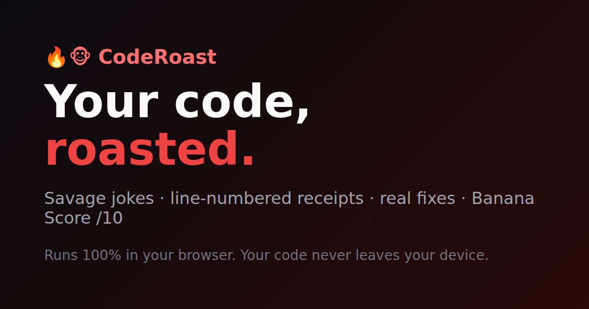

# CodeRoast 🔥🐵

**Your code, roasted.** Paste code or a GitHub link and get a brutally funny roast with **line-numbered receipts**, **real fixes**, and a **Banana Score** to brag about.

Runs 100% in your browser. No signup, no server, and your code never leaves your device.



## Features

- ⚡ **Instant roasts on any device.** A built-in static analyzer (28 rules) plus a joke engine. No download, no GPU, results in milliseconds.
- 🧠 **AI roasts (optional).** Runs a small code LLM locally via WebGPU ([WebLLM](https://github.com/mlc-ai/web-llm)), grounded in the analyzer's findings.
- 🧾 **Receipts + fixes.** Every joke points at real lines and tells you how to fix them.
- ⚔️ **Roast battles:** two snippets enter, one winner leaves, with a shareable battle card.
- 📦 **Roast a whole repo:** paste `github.com/owner/repo` and get a repo score plus a "crime scene" of the worst files.
- 🔗 **Share links** that carry only the roast (never your code). Each one gets its own preview image on X, Slack, Discord, and other sites, and opens a challenge page.
- 🖼️ **Meme card PNG**, X/LinkedIn sharing, native share sheet.
- 🍌 **README badge.** Show off your score: [](https://github.com/StormDoragon/CodeRoast)
- 😌 / 🔥 / 💢 **Gentle, Savage, Unhinged** intensity.
- Languages: JavaScript, TypeScript, Python, Go, Rust, Java/Kotlin, C#, PHP, Ruby, C/C++ (auto-detected).
- 🙄 **Bad roast?** One click opens a prefilled GitHub issue (rule names and line numbers only, never your code).
- Installable PWA, local roast history.

## CodeRoast for pull requests

Get every PR roasted in a comment that updates itself, with a crime-scene table, receipts that link to the exact lines (🆕 marks lines the PR touched), fixes, and a shareable roast card.

```yaml
# .github/workflows/coderoast.yml
name: CodeRoast
on: pull_request
permissions:
  contents: read
  pull-requests: write
jobs:
  roast:
    runs-on: ubuntu-latest
    steps:
      - uses: StormDoragon/CodeRoast@main
        with:
          intensity: savage   # gentle | savage | unhinged
          fail-below: 0       # e.g. 4 to fail the check on a "Dumpster Fire"
```

| Input | Default | |
|---|---|---|
| `intensity` | `savage` | `gentle`, `savage` or `unhinged` |
| `fail-below` | `0` | Fail the check when the Banana Score is below this (0 = never) |
| `max-files` | `30` | Most-changed supported files to roast |
| `comment` | `true` | Post/update a PR comment (the roast always lands in the job summary) |

Outputs: `score`, `verdict`. Code is read through the GitHub API inside your own runner, so nothing is sent to CodeRoast. PRs from forks get a read-only token, so for those the roast appears in the job summary instead of a comment.

## Quick start

```bash
git clone https://github.com/StormDoragon/CodeRoast.git
cd CodeRoast
npm install
npm run dev
```

| Command | What it does |
|---|---|
| `npm run dev` | Dev server |
| `npm test` | Unit tests (vitest) |
| `npm run typecheck` | TypeScript check |
| `npm run build` | Typecheck + production build to `dist/` |

## Deploy

Live at **https://code-roast-five.vercel.app** (Vercel, auto-deploys from `main`; PRs get preview deployments).

Any static host works: build command `npm run build`, output directory `dist`. `vercel.json` sets long-lived caching for hashed assets and security headers.

Configure with env vars (see `.env.example`): `VITE_SITE_URL` (for share links and preview images), and optionally `VITE_SPONSOR_URL` and `VITE_PRO_WAITLIST_URL`.

### Analytics
Uses [Vercel Web Analytics](https://vercel.com/docs/analytics) (cookieless). Enable it in the Vercel project's *Analytics* tab. Funnel events: `roast`, `roast_again`, `example`, `github_load`, `share` (by channel), `share_open`, `share_cta`. The URL hash (which holds shared roast text) is stripped before anything is sent.

## How it works

```
code ──► analyzer.ts (rules, metrics, score) ──► roastLite.ts (jokes + fixes)   ⚡ instant
                                    └──────────► worker.ts → WebLLM (local GPU)  🧠 AI
```

- `src/lib/analyzer.ts`: dependency-free static analysis. Strings and comments are stripped before matching, and the score is 10 minus weighted, capped penalties.
- `src/lib/roastLite.ts`: seeded templates, so a roast is reproducible and "Roast again" re-rolls.
- `src/lib/share.ts`: share payloads are base64url JSON, validated on read. Links look like `/r/<payload>`.
- `api/share.ts` (edge) + `api/og.ts` (Node.js; the edge runtime can't compile `@vercel/og`'s WebAssembly outside Next.js): `/r/<payload>` returns preview tags for crawlers and redirects visitors to `/#r=<payload>`. `/api/og?d=<payload>` renders the per-roast preview image. Both are stateless, so there's still no database. Relative imports in `api/` need explicit `.js` extensions, because Vercel runs them as native ESM.
- `action/`: the GitHub Action. `npm run build:action` bundles it to `action/dist/index.cjs`, which is committed (CI checks it is up to date).
- `src/lib/repoRoast.ts`: repo roasts. Two GitHub API calls (default branch and file tree), then up to 30 files fetched from raw.githubusercontent.com.

## Roadmap

See [docs/ROADMAP.md](docs/ROADMAP.md) for the goal, launch plan, and business model.

## Contributing

PRs welcome, especially:
- New rules (add to `LINE_RULES` + a template in `roastLite.ts` + a test)
- Funnier jokes (keep them about the code, never the person)
- More languages

License: MIT
